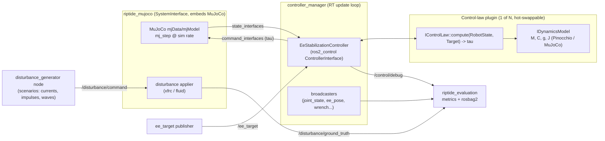

# Riptide — EE Stabilization of a Floating-Base AUV+Arm

Control-approach test rig: a **ROS 2 (Jazzy, C++)** controller stack driving a
**MuJoCo** simulation of an AUV with a robotic arm, stabilizing the arm's
end-effector under heavy hydrodynamic disturbances.

The single most important non-functional requirement is **extensibility**: the
set of available sensors and actuators *will* change, and control approaches
must be swappable and comparable. Every design decision below is made to keep
those two axes cheap to change.

---

## 1. Goals & requirements

| # | Requirement | Consequence for architecture |
|---|-------------|------------------------------|
| R1 | Controller is a ROS 2 node, receives sensor values from MuJoCo, publishes joint torques | Torque-level command interface; low-latency state feedback |
| R2 | Sensors and actuators change frequently | Declarative hardware description; controllers address interfaces by *logical name*, never by index |
| R3 | Test 4 control approaches (PID, task-space impedance, LQR, MPC) side by side | Control law = a swappable plugin; ROS plumbing separated from control math |
| R4 | Heavy disturbances | Dedicated, scriptable disturbance injection + ground-truth logging |
| R5 | Floating base + arm coupling | Whole-body dynamics model available to controllers (M, C, g, Jacobians) |
| R6 | Reproducible comparison | Scenario-driven, headless-capable evaluation harness with metrics |

---

## 2. Framework decision: `ros2_control` (with an escape hatch)

**Use `ros2_control` as the backbone**, not hand-rolled topic wiring.

Why this fits R2/R3 better than plain nodes:

- **Sensors/actuators are declarative.** A `<ros2_control>` block in the robot
  description defines `state_interfaces` (sensors) and `command_interfaces`
  (actuators). Adding a sensor = adding a few lines of XML + config. No control
  code changes. This is exactly R2.
- **Controllers are `pluginlib` plugins** managed by `controller_manager`, with
  lifecycle, hot (re)loading, and a real-time update loop. This is exactly R3.
- **The MuJoCo side becomes a `hardware_interface::SystemInterface`** — one well-
  defined seam between "simulator" and "everything else."
- Batteries included: `realtime_tools`, state/command interface claiming,
  chained controllers, `controller_manager` services for switching approaches at
  runtime.

**The tension to manage:** whole-body MPC/LQR (R5) needs the *full* dynamics
model, which doesn't map cleanly onto flat state/command interface arrays. We
resolve this by having controllers **own their own dynamics model** (§6),
loaded from the same description, and consume `ros2_control` only for *live
state and command I/O*. Interfaces carry measurements; the model carries physics.

**Escape hatch:** if `ros2_control`'s rigidity ever blocks a control approach,
the same `RobotState`→`τ` control-law plugins (§5) can be hosted inside a plain
`rclcpp` node instead — because the control math has no `ros2_control` dependency
by design. We keep that option open rather than betting everything on one host.

> Prior art to evaluate before writing the bridge: the community
> **`mujoco_ros2_control`** package already implements a `SystemInterface` that
> embeds MuJoCo and runs the `ros2_control` loop. Spike it in Phase 0; adopt or
> fork it if it holds up, otherwise build `riptide_mujoco` (§4) from scratch.
> Either way the seam is identical, so this choice is reversible.

---

## 3. High-level architecture



Two processes at minimum: `controller_manager` (with the MuJoCo `SystemInterface`
loaded as its hardware) and the auxiliary nodes (disturbance, target, evaluation).
MuJoCo runs **in-process** with the controller loop to keep the state→τ latency
deterministic; auxiliary nodes talk over normal DDS topics where latency doesn't
matter.

---

## 4. Package breakdown (colcon workspace)

```
riptide_ws/src/
├── riptide_description/     # MJCF + URDF (xacro), meshes, ros2_control tags, hydro params
├── riptide_mujoco/          # MuJoCo SystemInterface + disturbance applier
├── riptide_dynamics/        # IDynamicsModel abstraction + Pinocchio/MuJoCo backends
├── riptide_control/         # EeStabilizationController + the 4 IControlLaw plugins
├── riptide_msgs/            # EndEffectorTarget, DisturbanceCommand, ControlDebug, ...
├── riptide_disturbance/     # disturbance_generator node + scenario library
├── riptide_evaluation/      # metrics node, benchmark runner, launch_testing scenarios
└── riptide_bringup/         # launch files, controller/broadcaster YAML, scenario configs
```

Rationale: description / simulator / dynamics / control / evaluation are the
things that change on independent clocks. Keeping `riptide_control` free of any
MuJoCo dependency (it only sees `ros2_control` interfaces + `IDynamicsModel`)
means the whole control stack could later run against real hardware by swapping
only `riptide_mujoco` for a real `SystemInterface`.

---

## 5. Control-law plugin interface (the heart of R3)

Separate **ROS plumbing** (one controller) from **control math** (N plugins).
The `EeStabilizationController` is the only `ros2_control` controller. It:

1. Claims state/command interfaces by logical name (from YAML, §7).
2. Assembles a framework-agnostic `RobotState` each cycle.
3. Delegates to the currently selected `IControlLaw`.
4. Writes the returned torque vector to the command interfaces.

```cpp
// riptide_control/include/riptide_control/control_law_interface.hpp
namespace riptide_control {

struct RobotState {
  double time;
  Eigen::VectorXd q;          // arm joint positions
  Eigen::VectorXd dq;         // arm joint velocities
  Eigen::Isometry3d base_pose;   // floating-base pose (world <- base)
  Eigen::Matrix<double,6,1> base_twist;   // floating-base velocity
  Eigen::Isometry3d ee_pose;  // convenience (also derivable from model)
  // Optional/dynamic sensors keyed by logical name so control laws can
  // opt into new sensors without an ABI change (R2).
  std::map<std::string, Eigen::VectorXd> extra;   // e.g. "ee_ft", "dvl", "imu"
};

struct EndEffectorTarget {
  Eigen::Isometry3d pose;
  Eigen::Matrix<double,6,1> twist;
  Eigen::Matrix<double,6,1> accel;
};

class IControlLaw {
public:
  virtual ~IControlLaw() = default;
  // Called once with node params + the shared dynamics model.
  virtual bool on_configure(const rclcpp::Node::SharedPtr & node,
                            std::shared_ptr<IDynamicsModel> model) = 0;
  // Real-time safe: no allocation, no logging, no locks.
  virtual Eigen::VectorXd compute(const RobotState & state,
                                  const EndEffectorTarget & target,
                                  double dt) = 0;
  virtual void reset() = 0;
};

}  // exported via pluginlib PLUGINLIB_EXPORT_CLASS
```

The four approaches become four plugin classes over the **same** interface:

| Plugin | Uses model? | Notes |
|--------|-------------|-------|
| `PidControlLaw` | No (task-space PID via `J`) | Baseline. Per-joint and Cartesian PD variants. |
| `ImpedanceControlLaw` | Yes (`M`, `C`, `g`, `J`) | Operational-space / Cartesian impedance — natural fit for stabilization; gravity+Coriolis compensation using the whole-body model so base motion is rejected. |
| `LqrControlLaw` | Yes (linearization) | Linearize about operating point(s); gain scheduling optional. |
| `MpcControlLaw` | Yes (full model, horizon) | Whole-body QP/MPC (e.g. OSQP/acados backend) accounting for base–arm coupling; heaviest, may run at a lower rate feeding an inner task-space loop. |

Because `compute()` is a pure `RobotState → τ` function with no ROS/MuJoCo
dependency, **every control law is unit-testable in isolation** and "test all 4"
(R3) becomes: load plugin → run scenario → collect metrics (§9).

Runtime selection: a controller parameter `active_control_law` +
`pluginlib::ClassLoader`; switching is a parameter set (or a small service) — no
relaunch, same `controller_manager` session.

---

## 6. Dynamics model abstraction (R5)

```cpp
class IDynamicsModel {
public:
  virtual void update(const RobotState &) = 0;
  virtual const Eigen::MatrixXd & massMatrix() const = 0;      // M(q)
  virtual const Eigen::VectorXd & nonlinear() const = 0;       // C(q,dq)dq + g
  virtual Eigen::MatrixXd jacobian(const std::string & frame) const = 0;
  virtual Eigen::Isometry3d framePose(const std::string & frame) const = 0;
  // Hydrodynamics hook so control laws can compensate added-mass/drag.
  virtual Eigen::VectorXd hydroForces(const RobotState &) const = 0;
};
```

Backends:
- **`PinocchioModel`** — fast analytical multibody dynamics for the arm +
  floating base (6-DoF root joint). Preferred for control (deterministic,
  RT-friendly, well-tested derivatives for MPC).
- **`MujocoModel`** — reuses `mjModel` as a dynamics oracle; useful for
  "perfect model" experiments and cross-checking Pinocchio.

Hydrodynamic terms (added mass, drag, buoyancy) are supplied via `hydroForces()`
using a Fossen-style parameter set stored in `riptide_description`, so a
controller *can* model the water it's fighting — separate from what the
simulator applies, letting you study model mismatch deliberately.

---

## 7. Extensibility mechanism — adding a sensor or actuator (R2, the key demo)

The whole point. Concretely, adding, say, a **DVL (Doppler velocity log)** sensor
touches only configuration:

1. **`riptide_description`** — add sensor to MJCF and expose it as a
   `state_interface` in the `<ros2_control>` block:
   ```xml
   <sensor name="dvl">
     <state_interface name="vx"/>
     <state_interface name="vy"/>
     <state_interface name="vz"/>
   </sensor>
   ```
2. **`riptide_mujoco`** — the `SystemInterface` auto-exports every declared
   interface by reading the description (a name→`mjData` address map built at
   `on_init`); a new MuJoCo `<sensor>` with a matching name is picked up with
   **zero C++ changes**.
3. **Controller YAML** — map the logical name into what a control law consumes:
   ```yaml
   ee_stabilization_controller:
     ros__parameters:
       state_interfaces:
         base_twist: ["dvl/vx", "dvl/vy", "dvl/vz", "imu/wx", "imu/wy", "imu/wz"]
       extra_sensors: ["ee_ft"]   # surfaced in RobotState.extra
   ```

Control laws never see interface indices or MuJoCo IDs — only logical names and
the `RobotState` struct. Same story for actuators: a new thruster/joint is a
`command_interface` entry; a controller opts in by claiming it in YAML.

**Design rules that keep this true:**
- No control code addresses interfaces positionally — always by name via a
  config-built map.
- `RobotState.extra` (a name-keyed map) absorbs new sensors without changing the
  struct's ABI.
- The `SystemInterface` builds its interface list *from the description*, so the
  description is the single source of truth for hardware.

---

## 8. MuJoCo model plan (`riptide_description`) — R4/R5

Since we're building the model from scratch:

- **Kinematics:** AUV hull as a body with a **free joint** (6-DoF floating base);
  serial arm as child bodies with hinge joints; end-effector site/frame for the
  stabilization target. Authored in **xacro → URDF** and MJCF kept consistent
  (or MJCF generated and URDF derived) so Pinocchio and MuJoCo agree.
- **Actuators:** `motor` actuators on arm joints (direct torque = R1). Optional
  thruster actuators on the hull for base-assist experiments (also just
  `command_interface`s — swappable per R2).
- **Hydrodynamics:** start with MuJoCo's built-in **ellipsoid fluid model**
  (`<option density viscosity>` + per-geom `fluidshape`) for added mass, drag,
  and buoyancy — cheap and native. Upgrade path: a custom passive-force plugin
  (`mjcb_passive`) applying a Fossen added-mass/damping/buoyancy model for higher
  fidelity. Hydro parameters live in the description so sim and controller model
  can be intentionally matched or mismatched.
- **Disturbances (R4):** applied as external wrenches on `mjData.xfrc_applied`
  by the disturbance applier inside `riptide_mujoco`, commanded over
  `/disturbance/command`. Scenario library in `riptide_disturbance`: steady
  current, sinusoidal/wave loading, random gusts, impulse hits, and combinations.
  Every applied wrench is published on `/disturbance/ground_truth` for analysis.

---

## 9. Evaluation harness ("4 approaches as tests") — R6

Treat each controller run as a repeatable experiment.

- **Scenario spec** (YAML): initial state, EE target trajectory, disturbance
  program, duration, control law + gains.
- **Benchmark runner** in `riptide_evaluation`: launches sim + controller
  **headless**, iterates over `{control_law} × {scenario}`, records `rosbag2`.
- **Metrics node** computes per run: EE position/orientation RMS error, max
  deviation, settling time after impulse, control effort (∫‖τ‖²), constraint/
  torque-limit violations, disturbance-rejection ratio.
- **Automated tests:** `launch_testing` cases that assert e.g. "impedance keeps
  EE error < X cm under current scenario Y" — so regressions in a control law are
  caught in CI. This is the literal "make all 4 approaches as tests" deliverable.
- **Comparison report:** a small script aggregates the bags into a table/plot
  comparing the four approaches across scenarios.

Determinism: fixed MuJoCo timestep, fixed RNG seed per scenario, headless run →
byte-reproducible metrics for fair comparison.

---

## 10. Timing & real-time

- MuJoCo `mj_step` at a fine sim timestep (e.g. 1 kHz); `controller_manager`
  update loop matched to it since MuJoCo is in-process.
- Control laws are **RT-safe** (`compute()`: no heap, no logging, no locks — use
  `realtime_tools`, preallocated Eigen buffers, `RealtimeBuffer` for async
  targets/params). MPC, if too heavy for the inner rate, runs on its own thread
  at a lower rate and publishes a reference the inner loop tracks.
- Auxiliary nodes (disturbance, target, evaluation) are **non-RT** and
  deliberately kept off the control path.

---

## 11. Phased roadmap

| Phase | Deliverable | Exit criterion | Status |
|-------|-------------|----------------|--------|
| **0. Spike** | MuJoCo seam (turned into a full custom SystemInterface, no `mujoco_ros2_control` needed); MJCF base+arm, no hydro | `controller_manager` reads joint states from MuJoCo, writes a torque, arm moves | ✅ done |
| **1. Skeleton** | All packages scaffolded; `riptide_msgs`; description with `<ros2_control>` tags; broadcasters | hardware-interface listing shows expected sensors/actuators from the description | ✅ done |
| **2. Baseline loop** | `JointPdController` + task-space `EeStabilizationController` + `IDynamicsModel`(Pinocchio) done | EE holds a static target with base fixed | ✅ done |
| **3. Floating base + hydro** | Free-joint base, fluid model, disturbance applier + generator | EE stabilizes under a steady-current disturbance | 🟡 infra done |
| **4. Control zoo** | `TaskSpaceImpedance` done (pluginlib `IControlLaw`); LQR, MPC pending | All 4 selectable at runtime, each holds target under moderate disturbance | 🟡 impedance |
| **4b. Base dynamic positioning** | Hull thrusters (5, via `<gpio>`) + geometry-derived allocator + `BaseThrusterController` | Base holds station under current (surge/heave held, roll/pitch level) | ✅ done (sway/yaw unactuated) |
| **5. Evaluation** | Scenario library, benchmark runner, metrics, `launch_testing` | Automated comparison report over the 4 across ≥3 disturbance scenarios | ⬜ |
| **6. Extensibility proof** | Add a new sensor (e.g. DVL) + a thruster actuator via config only | New hardware appears end-to-end with **no** control-code change | ⬜ |

Notes: the arm is the **Franka fer (Panda)**; the MuJoCo seam (Phase 0) was
built as a full custom `riptide_mujoco/MujocoSystem` rather than a throwaway
spike, and the `ros2 control` CLI (`ros2controlcli`) isn't installed here so the
hardware listing is queried via `controller_manager` services. Phase 6 is
intentionally a first-class milestone: it's the acceptance test for R2.

Phases 2 & 3 are "🟡": Phase 3 *infrastructure* (floating `<freejoint/>` base,
fluid drag/added-mass, base pose/twist as a ros2_control sensor + TF/odom,
topic-driven disturbance injection with ground truth, and the scenario
generator) is complete and verified. Both exit criteria — *EE holds a static
target* (Phase 2) and *EE stabilizes under a current* (Phase 3) — require the
task-space controller, which is Phase 4. Buoyancy is modelled as neutral
(zero-g); an explicit Fossen buoyancy+gravity model is the fidelity upgrade.

---

## 12. Key risks & open questions

- **Hydrodynamics fidelity vs effort.** MuJoCo's ellipsoid fluid model may be too
  coarse for "heavy" disturbances; budget for the custom Fossen passive-force
  plugin. *Decision point at Phase 3.*
- **`ros2_control` vs whole-body MPC ergonomics.** Mitigated by the model-owns-
  physics split (§2/§6); revisit if MPC's I/O needs outgrow the interface model —
  the plain-node escape hatch is pre-designed.
- **URDF/MJCF consistency.** Two model files can drift; pick one source of truth
  (recommend MJCF-authored + URDF for Pinocchio/ros2_control, with a consistency
  check in CI).
- **RT on stock Linux.** Kernel isn't `PREEMPT_RT`; for a sim rig soft-RT is fine,
  but note it if control rates or MPC solve times get tight.
- **Thruster allocation** (if base-assist thrusters are used): needs an allocator
  — scope it only if hull actuation is in play.

---

## 13. Tech stack

- ROS 2 **Jazzy**, C++17, `ament_cmake`, `colcon`
- `ros2_control` / `controller_manager` / `pluginlib` / `realtime_tools`
- **MuJoCo** (in-process C API), optional `mujoco_ros2_control`
- **Pinocchio** (dynamics), **Eigen** (linear algebra)
- MPC/QP backend: **acados** or **OSQP** (decide at Phase 4)
- `rosbag2`, `launch_testing` (evaluation/CI)

---

### One-paragraph summary

Build a `ros2_control` stack on Jazzy where MuJoCo lives behind a single
`SystemInterface` (`riptide_mujoco`), the robot description is the sole source of
truth for which sensors/actuators exist, and one `EeStabilizationController`
delegates the actual control math to hot-swappable `IControlLaw` plugins (PID,
impedance, LQR, MPC) that consume a framework-agnostic `RobotState` and an
`IDynamicsModel` — never raw interfaces. That split makes adding a sensor or
actuator a config-only change, makes "test all four approaches" a matter of
loading a different plugin, and keeps the whole control stack portable to real
hardware by swapping only the simulator package.
