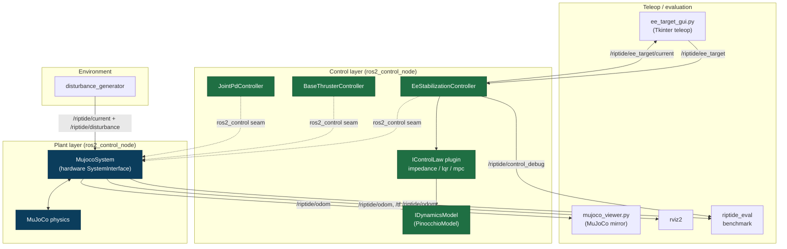
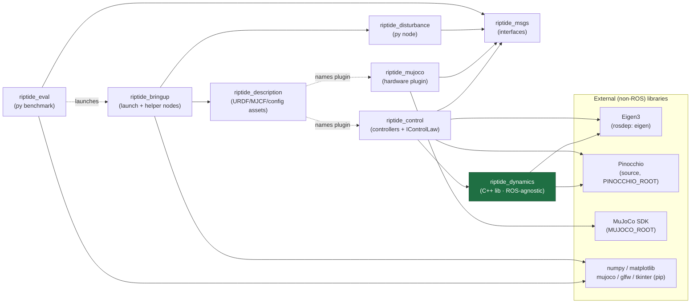
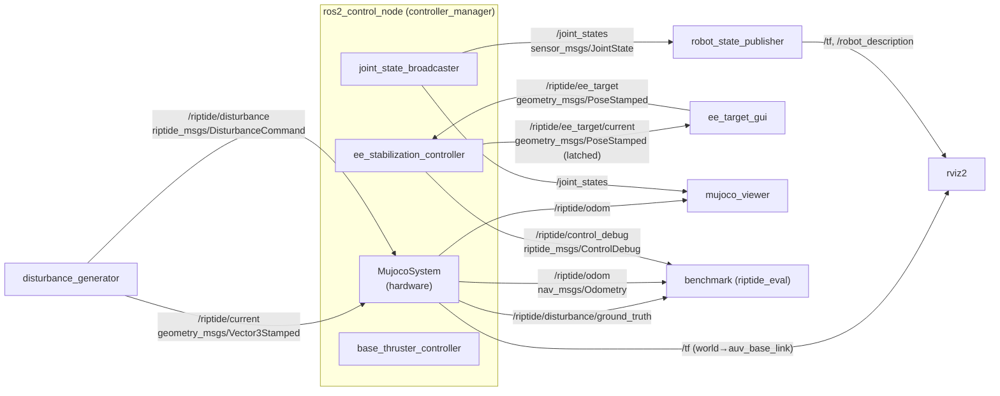
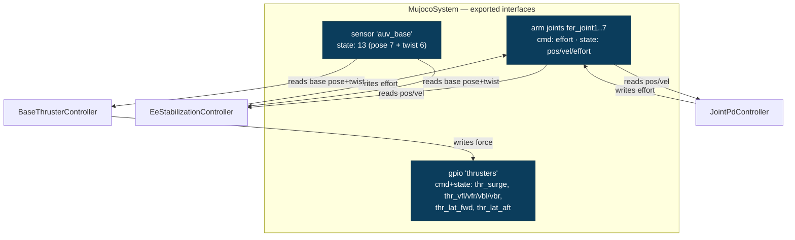
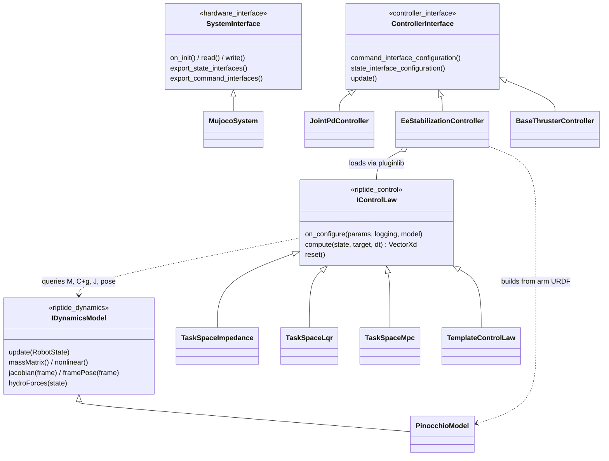
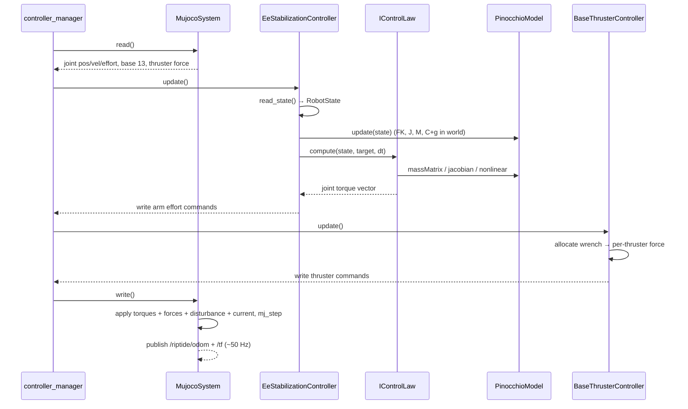
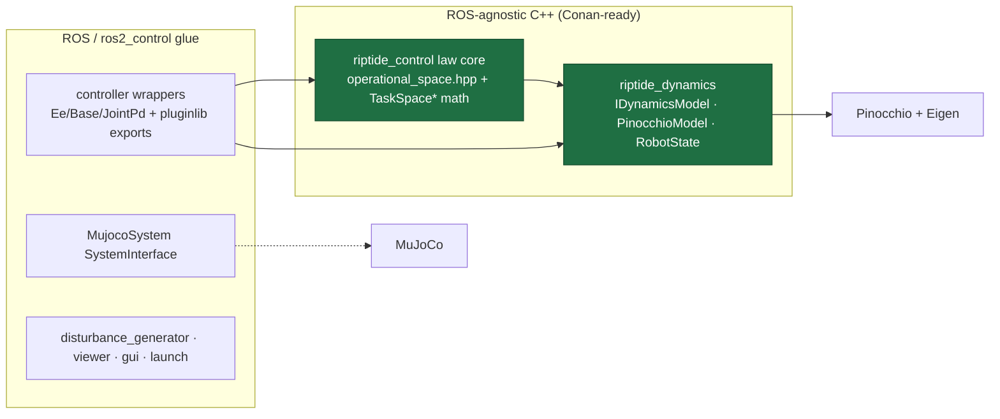

# Riptide — Architecture

Riptide is a control-approach test rig for **end-effector stabilization of a
floating-base AUV + robotic arm** under heavy disturbances. A ROS 2 (Jazzy, C++)
control stack drives a MuJoCo simulation; controllers read sensors and publish
joint torques + thruster forces across the `ros2_control` seam.

This document maps the code structure and the interfaces between its parts. All
diagrams are Mermaid and render inline on GitHub and in most IDEs.

---

## 1. Layered view

The stack separates into four layers. The single boundary between the simulator
and every controller is the **`ros2_control` seam**; the single boundary between
a control law and the physics it reasons about is **`IDynamicsModel`**.

---

## 2. Package map & build/link dependencies

Eight `riptide_*` packages (the vendored `franka_description` and legacy
`reach_bravo_description_mk2` are asset-only and omitted here).

Solid arrows are build/link dependencies; dashed arrows are runtime references
(a package names another's plugin/launch by string, with no compile-time link).
**`riptide_dynamics` (green) is fully ROS-agnostic** — the single most important
fact for the Conan-packaging roadmap (see §7).

| Package | Language | Role | Key deps |
|---|---|---|---|
| `riptide_msgs` | IDL | `EndEffectorTarget`, `DisturbanceCommand`, `ControlDebug` | std_msgs, geometry_msgs |
| `riptide_dynamics` | C++ lib | `IDynamicsModel`, `PinocchioModel`, `RobotState` | **Eigen, Pinocchio only** |
| `riptide_control` | C++ | 3 controllers + 4 `IControlLaw` plugins | riptide_dynamics, riptide_msgs, pluginlib, controller_interface |
| `riptide_mujoco` | C++ | `MujocoSystem` hardware plugin | riptide_msgs, MuJoCo, hardware_interface, tf2_ros, nav_msgs |
| `riptide_disturbance` | Python | `disturbance_generator` node | rclpy, riptide_msgs, geometry_msgs |
| `riptide_eval` | Python | `benchmark` runner | rclpy, riptide_msgs, numpy, matplotlib |
| `riptide_description` | assets | URDF/MJCF, the ros2_control seam, controller config | xacro (build) |
| `riptide_bringup` | launch + py | `sim.launch.py` + `mujoco_viewer.py` + `ee_target_gui.py` | riptide_description, riptide_disturbance |

---

## 3. Runtime graph — nodes & topics

Every edge is a ROS topic labelled with its message type. The controllers and
the MuJoCo hardware all live inside the single `ros2_control_node` process
(dashed box); they are drawn separately because each owns distinct topics and
`ros2_control` interfaces.

**Topic reference:**

| Topic | Type | Producer → Consumer |
|---|---|---|
| `/riptide/ee_target` | `geometry_msgs/PoseStamped` | ee_target_gui → EeStabilizationController |
| `/riptide/ee_target/current` | `geometry_msgs/PoseStamped` (latched) | EeStabilizationController → teleop (seed) |
| `/riptide/control_debug` | `riptide_msgs/ControlDebug` | EeStabilizationController → riptide_eval |
| `/riptide/odom` | `nav_msgs/Odometry` | MujocoSystem → eval, viewer |
| `/riptide/current` | `geometry_msgs/Vector3Stamped` | disturbance_generator → MujocoSystem (fluid `wind`) |
| `/riptide/disturbance` | `riptide_msgs/DisturbanceCommand` | disturbance_generator → MujocoSystem (point wrench) |
| `/riptide/disturbance/ground_truth` | `riptide_msgs/DisturbanceCommand` | MujocoSystem → eval |
| `/joint_states` | `sensor_msgs/JointState` | joint_state_broadcaster → RSP, viewer |
| `/tf`, `/robot_description` | tf2_msgs / std_msgs | MujocoSystem + robot_state_publisher |

---

## 4. The `ros2_control` seam

`riptide_description/urdf/riptide.ros2_control.xacro` declares one system,
`RiptideSystem`, whose `<hardware>` plugin is swappable (`mock_components/
GenericSystem` for the no-physics path, `riptide_mujoco/MujocoSystem` for real
physics). Controllers address the exposed interfaces **by name**, never by index,
so adding an actuator or sensor is a declarative change to the xacro.

- **Arm joints** (`fer_joint1..7`): effort command, position/velocity/effort state.
- **`auv_base` sensor** (13 state interfaces): `position.{x,y,z}`,
  `orientation.{x,y,z,w}`, `linear_velocity.{x,y,z}`, `angular_velocity.{x,y,z}`.
- **`thrusters` gpio** (7 command + 7 state): one force interface per thruster;
  the geometry (positions/axes) is mirrored between `generate_scene.py` and
  `riptide_controllers.yaml`.
- **Hardware params** (MuJoCo path): `mjcf_model`, `floating_base_joint`,
  `base_link_frame`, `water`, `fixed_base`.

`EeStabilizationController` and `BaseThrusterController` claim **disjoint** command
interfaces (arm effort vs thruster force), so they run simultaneously.

---

## 5. Plugin & class interfaces

Three plugin families, each behind a stable base class, make the stack
hot-swappable at runtime.

- `SystemInterface` / `ControllerInterface` are **pluginlib** exports registered
  in `plugins.xml` / `controller_plugins.xml` — discovered by the
  controller_manager at runtime.
- `IControlLaw` is a pluginlib base **defined by `riptide_control`** itself
  (`control_law_plugins.xml`); `EeStabilizationController` picks the concrete law
  from the `control_law` parameter.
- `IDynamicsModel` is a **plain C++ virtual interface** (not pluginlib) — a
  control law owns one instance and refreshes it each cycle, keeping physics off
  the real-time I/O path. `PinocchioModel` is the only backend today.
- `TaskSpace*` laws share `operational_space.hpp` (task-space error → wrench →
  `Jᵀ` torque + dynamically-consistent nullspace); they differ only in how the
  desired task acceleration is produced.

---

## 6. One control cycle

At ~250 Hz the controller_manager drives read → controllers.update → write.

The desired target enters asynchronously: `ee_target_gui` publishes
`/riptide/ee_target`, whose latest value the EE controller latches into `target`
(overriding its startup capture); `disturbance_generator` publishes the flow
`/riptide/current` and point `/riptide/disturbance` the hardware applies in
`write()`.

---

## 7. External dependencies & the packaging seam

How each non-ROS dependency is located today — the starting point for the
Conan-packaging roadmap (`docs/plan/`).

| Library | Used by | Found via |
|---|---|---|
| Eigen3 | riptide_dynamics, riptide_control | rosdep `eigen` + `eigen3_cmake_module` |
| Pinocchio | riptide_dynamics, riptide_control | **source build**, CMake `PINOCCHIO_ROOT` (not rosdep) |
| MuJoCo SDK | riptide_mujoco | CMake `MUJOCO_ROOT` (not rosdep) |
| numpy, matplotlib | riptide_eval | rosdep `python3-numpy`, `python3-matplotlib` |
| mujoco, glfw (pip) | mujoco_viewer.py | pip in the ROS Python |
| tkinter | ee_target_gui.py | system `python3-tk` |

**ROS-agnostic core vs ROS glue** — the seam a Conan split runs along:

- `riptide_dynamics` is **already** a standalone C++ library — no
  rclcpp/ros2_control/pluginlib anywhere; only Eigen + Pinocchio. It is the
  cleanest first Conan package.
- The `TaskSpace*` control-law **math** (`operational_space.hpp` + the compute
  cores) is ROS-agnostic in substance but currently compiled inside the
  `riptide_control` ament library alongside the pluginlib controller wrappers;
  extracting it is the second Conan candidate.
- Everything that includes `rclcpp`, `controller_interface`, `hardware_interface`,
  or `rclpy` is ROS glue and stays in ROS packages that *consume* the Conan
  libraries.

The target Conan package graph, the downward-only layer invariant, and the
verified boundary-violation baseline are frozen in
[`docs/adr/0001-conan-package-taxonomy.md`](adr/0001-conan-package-taxonomy.md)
and enforced by `tools/check_layer_boundaries.sh`. See `docs/plan/` for the
step-by-step roadmap to a multi-Conan-package project.
